# AI Empire Control Plane - Design Document

## Overview

The AI Empire is a comprehensive suite of 22 interconnected Elixir packages designed as a production-grade AI control plane. Built on BEAM's actor model and fault-tolerance principles, the empire provides a unified platform for managing, orchestrating, and observing complex AI systems at scale.

The architecture follows a ministry-based organization, where each ministry represents a distinct domain of AI infrastructure concerns. This design leverages Elixir's strengths in concurrent processing, fault tolerance, and distributed systems to create a resilient AI management platform.

### Design Philosophy

- **Fault Tolerance First**: Every component is designed with supervision trees and graceful degradation
- **Asynchronous by Default**: Leverages BEAM's message passing for scalable, non-blocking operations  
- **Observability Built-in**: Comprehensive telemetry and tracing across all components
- **Type Safety**: Runtime contract validation and compile-time type checking where possible
- **Incremental Adoption**: Packages can be adopted independently with clear upgrade paths

## Architecture

### Ministry Organization

The AI Empire is organized into five ministries, each with distinct responsibilities and architectural patterns:

```mermaid
graph TB
    subgraph "Ministry of Infrastructure & Governance"
        foundation[foundation]
        perimeter[perimeter]
        elixir_scope[elixir_scope]
        aitrace[aitrace]
    end
    
    subgraph "Ministry of Data & Integrity"
        json_remedy[json_remedy]
        sinter[sinter]
        exdantic[exdantic]
        aqueduct[aqueduct]
    end
    
    subgraph "Ministry of Orchestration & Automation"
        pipeline_ex[pipeline_ex]
        dspex[dspex]
        altar[altar]
        mabeam[mabeam]
    end
    
    subgraph "Ministry of Foreign Affairs & Integration"
        gemini_ex[gemini_ex]
        claude_code_sdk[claude_code_sdk]
        snakepit[snakepit]
        playwriter[playwriter]
        indexicon[indexicon]
    end
    
    subgraph "Ministry of Command & Deployment"
        citadel[citadel]
        arsenal[arsenal]
        assessor[assessor]
        aegis[aegis]
        crucible[crucible]
    end
    
    %% Core Foundation Dependencies (solid lines)
    foundation -.-> sinter
    foundation -.-> pipeline_ex
    foundation -.-> citadel
    foundation -.-> gemini_ex
    foundation -.-> claude_code_sdk
    foundation -.-> indexicon
    foundation -.-> aegis
    foundation -.-> mabeam
    foundation -.-> aqueduct
    
    %% Data Layer Dependencies
    perimeter --> exdantic
    perimeter --> altar
    sinter --> exdantic
    sinter --> aqueduct
    json_remedy --> gemini_ex
    json_remedy --> claude_code_sdk
    
    %% Orchestration Dependencies
    pipeline_ex --> dspex
    pipeline_ex --> gemini_ex
    pipeline_ex --> claude_code_sdk
    pipeline_ex --> indexicon
    mabeam --> altar
    altar --> gemini_ex
    altar --> claude_code_sdk
    
    %% Command Layer Dependencies
    citadel --> arsenal
    citadel --> assessor
    citadel --> aegis
    citadel --> crucible
    aitrace --> aegis
    aitrace --> assessor
    
    %% Integration Dependencies
    indexicon --> snakepit
    
    %% Dashed lines represent foundational dependencies
    %% Solid lines represent direct functional dependencies
```



### Core Architectural Patterns

#### 1. Layered Dependency Architecture
- **Foundation Layer**: Core infrastructure (foundation, perimeter)
- **Data Layer**: Schema and validation (sinter, exdantic, json_remedy)
- **Orchestration Layer**: Workflow and agent management (pipeline_ex, dspex, mabeam)
- **Integration Layer**: External service clients (gemini_ex, claude_code_sdk, snakepit)
- **Command Layer**: Management and deployment (citadel, arsenal, assessor)

#### 2. Supervision Strategy
Each package implements a three-tier supervision strategy:
- **Application Supervisor**: Top-level fault tolerance
- **Domain Supervisors**: Service-specific supervision trees
- **Worker Pools**: Managed worker processes for concurrent operations

#### 3. Telemetry Integration
All packages emit standardized telemetry events following the pattern:
- `[:ai_empire, :package_name, :operation, :event]`
- Centralized collection through `aitrace` for unified observability

**Proposed Implementation for 1M+ events/sec**: 
- Multi-stage telemetry pipeline using GenStage with backpressure
- ETS-based local buffering with periodic batch flushes
- Configurable sampling rates per package/operation
- Dedicated telemetry supervision tree isolated from business logic

#### 4. Layer Enforcement
**Enforcement Strategy**: Custom Mix task (`mix empire.check_deps`) validates architectural layers:
- Parses `mix.exs` dependencies across all empire packages
- Validates against allowed dependency matrix defined in `empire_deps.exs`
- Integrated into CI pipeline to prevent architectural drift
- Generates dependency graphs for visualization and auditing

## Components and Interfaces

### Ministry of Infrastructure & Governance

#### Foundation Package
**Design Rationale**: Provides the foundational patterns that all other packages build upon, ensuring consistency and reducing duplication across the empire.

**Core Architecture**:
- Centralized configuration management with runtime updates
- Standardized supervision tree patterns
- Common telemetry and logging infrastructure
- Shared caching layer with TTL and invalidation strategies

**Key Interfaces**:
```elixir
defmodule Foundation.Config do
  @spec get(atom(), atom(), any()) :: any()
  def get(package, key, default \\ nil)
  
  @spec subscribe(atom(), atom()) :: :ok
  def subscribe(package, key)
end

defmodule Foundation.Cache do
  @spec get(binary(), (-> any())) :: any()
  def get(key, fallback_fn)
  
  @spec invalidate(binary() | [binary()]) :: :ok
  def invalidate(keys)
end
```

**Proposed Implementation Details**:
- **Config Updates**: Registry-based pub/sub with ETS backing store. Subscribers receive `{:config_update, package, key, new_value}` messages
- **Cache Strategy**: Multi-tier caching with process-local ETS tables and optional Redis backend for distributed scenarios
- **Performance**: Config reads from ETS (sub-microsecond), cache hits from local ETS, misses trigger async refresh

#### Perimeter Package
**Design Rationale**: Provides runtime type safety and contract validation, essential for AI systems where data shapes can be unpredictable.

**Core Architecture**:
- Compile-time contract definition with runtime validation
- Performance-optimized validation with caching
- Integration with telemetry for contract violation tracking
- Gradual typing support for legacy code integration

### Ministry of Data & Integrity

#### Sinter Package
**Design Rationale**: Serves as the unified schema engine, providing high-performance validation that other packages can build upon.

**Core Architecture**:
- Compiled schema validation for maximum performance
- Extensible type system with custom validators
- JSON Schema compatibility for interoperability
- Streaming validation for large datasets

#### Aqueduct Package (New)
**Design Rationale**: AI systems require robust data ingestion from diverse sources. Aqueduct provides fault-tolerant ETL with built-in retry and monitoring.

**Core Architecture**:
- Source-agnostic ingestion with pluggable adapters
- Backpressure-aware streaming with GenStage
- Dead letter queues for failed processing
- Schema evolution support for changing data formats

### Ministry of Orchestration & Automation

#### Pipeline_ex Package
**Design Rationale**: Linear AI workflows are common but need robust error handling and observability. Pipeline_ex provides this with BEAM's fault tolerance.

**Core Architecture**:
- Step-based pipeline definition with rollback support
- Parallel execution where dependencies allow
- Circuit breaker pattern for external service calls
- Comprehensive audit logging for compliance

#### Mabeam Package
**Design Rationale**: Multi-agent systems require sophisticated lifecycle management and communication patterns that leverage BEAM's distributed capabilities.

**Core Architecture**:
- Agent registry with distributed discovery
- Message routing with **at-least-once delivery guarantees**
- Resource allocation and constraint management
- Hierarchical agent supervision

**Proposed Implementation Details**:
- **Message Delivery**: Persistent message queues with acknowledgment-based delivery using GenStage
- **Agent Discovery**: Distributed registry using `:global` with heartbeat monitoring
- **Resource Management**: Token bucket algorithm for rate limiting with ETS-based quota tracking
- **Supervision**: Dynamic supervisor trees with agent-specific restart strategies

### Ministry of Foreign Affairs & Integration

#### Indexicon Package (New)
**Design Rationale**: AI applications need flexible search capabilities. Indexicon provides a unified interface that can scale from in-process to distributed search.

**Core Architecture**:
- Pluggable backend architecture (Nx, OpenSearch, etc.)
- Unified query DSL with backend-specific optimization
- Automatic index management and optimization
- Hybrid search combining vector and traditional search

### Ministry of Command & Deployment

#### Aegis Package (New)
**Design Rationale**: Production AI systems need real-time guardrails. Aegis provides this as a high-performance firewall that can make decisions in microseconds.

**Core Architecture**:
- Rule engine with hot-swappable policies
- Real-time cost tracking and limiting
- PII detection with configurable sensitivity
- Quality-of-service fallback chains

**Proposed Implementation for Microsecond Latency**:
- **Rule Engine**: Compiled decision trees loaded into ETS tables for O(log n) lookups
- **Cost Tracking**: Atomic counters in ETS with sliding window calculations
- **PII Detection**: Pre-compiled regex patterns with optional Rust NIF for high-throughput scenarios
- **Hot Swapping**: Rules updated via ETS table swaps, zero-downtime policy changes
- **Fallback Chains**: Pre-computed fallback sequences stored as tuples for immediate access

## Data Models

### Core Empire Types

```elixir
defmodule AIEmpire.Types do
  @type package_name :: atom()
  @type ministry :: :infrastructure | :data | :orchestration | :integration | :command
  
  @type telemetry_event :: %{
    package: package_name(),
    operation: atom(),
    metadata: map(),
    timestamp: DateTime.t()
  }
  
  @type dependency_spec :: %{
    package: package_name(),
    type: :runtime | :compile_time,
    version: binary(),
    optional: boolean()
  }
end
```

### Configuration Schema

```elixir
defmodule AIEmpire.Config.Schema do
  use Sinter.Schema
  
  schema %{
    empire: %{
      telemetry: %{
        enabled: boolean(),
        backends: [atom()],
        sample_rate: float()
      },
      cache: %{
        adapter: atom(),
        ttl_seconds: integer(),
        max_size: integer()
      }
    }
  }
end
```

## Error Handling

### Empire-wide Error Taxonomy

```elixir
defmodule AIEmpire.Error do
  @type error_category :: :validation | :external_service | :resource_limit | :configuration
  
  defexception [:category, :package, :operation, :details, :recoverable]
  
  @spec categorize(Exception.t()) :: error_category()
  def categorize(exception)
  
  @spec recoverable?(Exception.t()) :: boolean()
  def recoverable?(exception)
end
```

### Fault Tolerance Strategy

1. **Circuit Breakers**: All external service calls protected by circuit breakers
2. **Bulkheads**: Resource isolation between different AI workloads
3. **Timeouts**: Configurable timeouts with exponential backoff
4. **Graceful Degradation**: Fallback modes for non-critical functionality

## Testing Strategy

### Package-Level Testing

Each package implements a comprehensive testing strategy:

1. **Unit Tests**: Core logic with property-based testing where applicable
2. **Integration Tests**: Inter-package communication and external service mocking
3. **Contract Tests**: API compatibility between package versions
4. **Performance Tests**: Benchmarking critical paths with statistical analysis

### Empire-Level Testing

1. **End-to-End Tests**: Complete workflows across multiple packages
2. **Chaos Engineering**: Fault injection to validate resilience
3. **Load Testing**: Scalability validation under realistic workloads
4. **Upgrade Testing**: Backward compatibility and migration paths

### Testing Infrastructure

**Strategic Decision**: Package testing infrastructure separately as `empire_test_support` to ensure consistent, high-quality testing patterns across all packages without circular dependencies.

```elixir
defmodule AIEmpire.Test.Support do
  @spec mock_external_service(atom(), keyword()) :: :ok
  def mock_external_service(service, responses)
  
  @spec simulate_failure(atom(), atom()) :: :ok
  def simulate_failure(package, operation)
  
  @spec measure_performance(function()) :: %{duration: integer(), memory: integer()}
  def measure_performance(fun)
end
```

**JSON Remedy Circuit Breaker**: Given json_remedy's dependency on LLM clients for repair operations, implement recursive failure prevention:
- Maximum repair depth limit (default: 2 attempts)
- Circuit breaker pattern for LLM repair calls
- Fallback to structural repair (bracket matching, quote fixing) when LLM repair fails
- Cost tracking to prevent expensive repair loops

## Performance Considerations

### Scalability Targets

- **Concurrent Operations**: 10,000+ simultaneous AI operations
- **Throughput**: 1M+ events per second through telemetry system
- **Latency**: Sub-millisecond response times for guardrail decisions
- **Memory**: Efficient memory usage with configurable limits

### Optimization Strategies

1. **ETS Caching**: Hot path data cached in ETS tables
2. **Binary Optimization**: Efficient binary handling for large AI payloads
3. **Process Pooling**: Managed worker pools for CPU-intensive operations
4. **Streaming**: GenStage-based streaming for large dataset processing

### Monitoring and Alerting

```elixir
defmodule AIEmpire.Monitoring do
  @spec track_performance(atom(), atom(), function()) :: any()
  def track_performance(package, operation, fun)
  
  @spec alert_on_threshold(atom(), number(), function()) :: :ok
  def alert_on_threshold(metric, threshold, callback)
end
```

This design provides a comprehensive foundation for implementing the AI Empire as a production-grade system that leverages BEAM's strengths while addressing the unique challenges of AI infrastructure management.