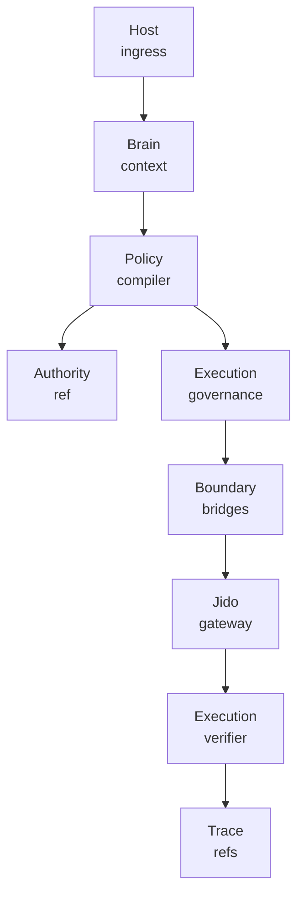
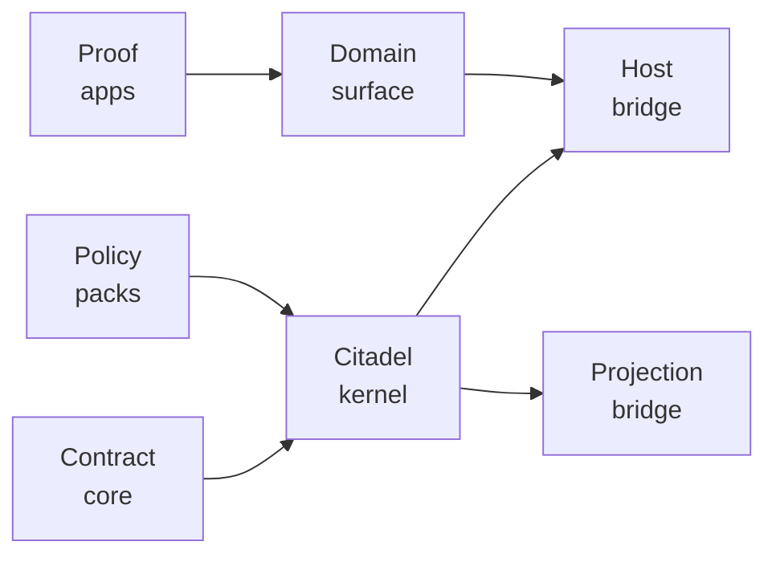
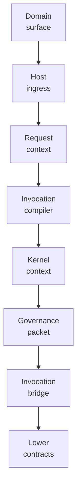
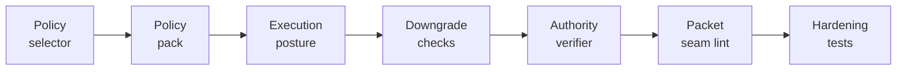

<p align="center">
  
</p>

<p align="center">
  <a href="https://github.com/nshkrdotcom/citadel">
    
  </a>
  <a href="https://github.com/nshkrdotcom/citadel/blob/main/LICENSE">
    
  </a>
</p>

# Citadel

Citadel is the host-local Brain kernel for a generic agentic OS. It accepts structured ingress at the kernel boundary, compiles Brain policy and planning decisions, preserves host-local session continuity, and projects Brain-authored packets toward the shared `jido_integration` contracts layer.

This repository is now aligned to the packet-defined non-umbrella workspace. The old single-package scaffold is gone; the package graph and ownership boundaries are the source of truth.

The workspace now also carries a separately publishable northbound typed surface
package:

- `surfaces/citadel_domain_surface`
- public namespace: `Citadel.DomainSurface`
- role: typed host-facing command, query, route, and capability boundary above
  the Citadel kernel

Maintainers should read
[Code Smell Remediation](guides/code_smell_remediation.md) before changing
signal ingress, session directory ownership, runtime contract values,
implicit application starts, or partition worker start paths.

## Stack Position

```text
host surfaces / shells
  -> Citadel
      -> jido_integration
          -> execution plane
              -> providers, runtimes, services, connectors
```

## Current Governance Surface

Citadel is the Brain-side governance kernel for the stack. The usable surface
today is not a product UI; it is the typed authority and policy machinery that
lets higher layers submit governed work without giving provider adapters or
runtime nodes permission to reinterpret the decision.

The current workspace provides four practical layers:

- contract packages for authority refs, execution governance packets,
  observability values, Jido Integration shared contracts, and host/kernel
  packet values
- policy-pack packages that compile coding-ops posture into explicit sandbox,
  egress, approval, tool, operation, workspace, command-class, and placement
  requirements
- bridge packages for invocation, query, signal, boundary, host ingress,
  projection, and trace adapter code
- thin proof applications and the `Citadel.DomainSurface` package for
  northbound host-facing commands, queries, routes, and capability boundaries

For governed execution, Citadel authors the authority reference and the
`ExecutionGovernance.v1` projection consumed below the kernel. That projection
names acceptable sandbox attestation classes, allowed tool and operation
families, approval mode, maximum egress, workspace mutability, and placement
intent. Downgrades are rejected before lower submission. Node hosts can use the
Citadel `ExecutionPlane.Authority.Verifier` implementation to validate Citadel
authority refs, but Citadel still does not become the lane host or lower
execution node.

The repo also carries the host-ingress bridge used by host applications that
need structured ingress into the kernel. That bridge accepts typed request
context, compiles invocation intent, and returns accepted-result contracts
without exposing lower provider calls, raw credentials, or durable execution
truth to the host shell.

Operationally, Citadel is the repo that answers: "Is this work allowed, under
which authority, with which posture, and with which traceable governance
packet?" Mezzanine owns durable lifecycle and workflow reduction. Jido
Integration owns connector/runtime invocation. Execution Plane owns node/lane
execution. AppKit and product repos consume the resulting read models and
controls.

The current Extravaganza cutover proof exercises Citadel as the authority owner
for source, publication, dynamic tool, runtime, evidence, and cleanup lanes.
Provider names remain acceptable as lower connector facts and product-visible
examples, but Citadel generic policy must authorize operation classes, posture,
binding refs, manifest refs, credential lease refs, and allowed tool classes
without becoming a provider-dispatch table.

## Governance Diagrams





## Developer Flow Diagrams





Citadel owns:

- canonical Brain context construction
- structured ingress handling at `IntentEnvelope`
- objective, plan, topology, and authority compilation
- host-local session continuity and runtime coordination
- projection into shared authority, invocation, review, and derived-state seams

Citadel does not own:

- durable run, attempt, approval, review, or artifact truth
- lower execution transports or provider runtimes
- raw credential lifecycle
- raw natural-language interpretation
- product-shell UI or channel state

For governed execution, Citadel authors the Brain-side governance packet and
authority reference. `ExecutionGovernance.v1` now requires
`sandbox.acceptable_attestation`, so a Brain decision names the target
attestation classes it is willing to admit instead of relying on implicit local
fallback. Citadel also provides an `ExecutionPlane.Authority.Verifier`
implementation that node hosts may register to validate Citadel authority refs;
that does not make Citadel a lane host or execution node.

The coding-ops policy pack now carries explicit execution posture: minimum
sandbox level, maximum egress, approval mode, allowed tools and operations,
workspace mutability, command classes, and local/remote placement intents.
`Citadel.Governance.SubstrateIngress` compiles that posture into
`ExecutionGovernance.v1` and rejects sandbox, egress, approval, tool,
operation, or placement downgrades before lower submission.

## Workspace

```text
citadel/
  core/
    contract_core/
    authority_contract/
    execution_governance_contract/
    observability_contract/
    policy_packs/
    citadel_governance/
    citadel_kernel/
    conformance/
  bridges/
    invocation_bridge/
    query_bridge/
    signal_bridge/
    boundary_bridge/
    host_ingress_bridge/
    projection_bridge/
    trace_bridge/
  apps/
    coding_assist/
    operator_assist/
    host_surface_harness/
  surfaces/
    citadel_domain_surface/
```

Package ownership is explicit:

- `core/*` owns values, contracts, policy packs, runtime coordination, and conformance.
- `bridges/*` owns adapter code only.
- `apps/*` owns thin proof-app composition shells and stays above the kernel.
- `surfaces/*` owns northbound publishable typed surfaces that sit above the
  kernel without becoming second cores.

The third proof app, `apps/host_surface_harness`, is part of the workspace from day one. It exists to prove host/kernel seams, multi-session behavior, and structured ingress above Citadel without pushing those concerns into the core.

The public structured host-ingress seam now lives in
`bridges/host_ingress_bridge`. That package owns the typed host-facing request
context, accepted-result contract, pure invocation compiler, and the public
`Citadel.HostIngress` facade that host applications call before the lower
`jido_integration` seam.

## Toolchain And Build

Citadel is pinned to Elixir `~> 1.19` and OTP 28. The repo-level `.tool-versions` file tracks the exact bootstrap pair:

- `elixir 1.19.5-otp-28`
- `erlang 28.3`

The root Mix project is a tooling-only workspace orchestrator. Wave 1 materializes the packet-pinned workspace tooling and dependency posture explicitly:

- `{:blitz, "~> 0.3.0", runtime: false}` for workspace fanout
- `{:weld, "~> 0.8.2", runtime: false}` for repo-local package projection and release preparation
- `{:jcs, "~> 0.2.0"}` in `core/contract_core` for RFC 8785 / JCS ownership

Common commands:

```bash
mix deps.get
mix monorepo.deps.get
mix monorepo.compile
mix monorepo.test
```

Static analysis and build hardening commands:

```bash
mix lint.packet_seams
mix lint.strict
mix monorepo.dialyzer
mix static.analysis
mix ci
```

Governance adversarial hardening commands:

```bash
mix hardening.governance.adversarial
mix hardening.governance.mutation
mix hardening.governance
```

- `mix hardening.governance.adversarial` runs the Wave 10 property suites in `core/citadel_governance` and `core/policy_packs`
- `mix hardening.governance.mutation` runs build-failing mutation checks for the same governance packages
- `mix hardening.governance` runs both gates

The Wave 9 hardening posture is enforced in code and CI:

- `mix lint.packet_seams` fails on unsafe string-to-atom calls anywhere in packet-critical workspace paths and blocks raw `map()` or `keyword()` public seam specs on the tracked ingress, bridge, runtime, and trace modules.
- `mix lint.strict` runs a curated high-signal Credo config across the workspace libraries instead of style-noise checks that do not protect packet seams.
- `mix static.analysis` also runs the `citadel_domain_surface` package-local
  seam lint and strict lint so the northbound typed boundary keeps its own
  publication discipline inside the monorepo.
- `mix monorepo.dialyzer` fans out `mix dialyzer --halt-exit-status` across the real workspace graph through Blitz, so any Dialyzer warning fails the build.
- `.github/workflows/ci.yml` runs format, compile, packet seam lint, strict lint, Dialyzer, and tests as separate CI steps.

Publication is now finalized as a derivative workspace boundary. The repo-local
Weld manifest lives at `packaging/weld/citadel.exs`, projects the public
`citadel` artifact in package-projection mode, keeps `apps/*`,
`core/conformance`, and `surfaces/citadel_domain_surface` out of the default
artifact, declares canonical `jido_integration_contracts` as a Jido-owned
external dependency, and preserves package ownership instead of flattening the
workspace into a monolith.

The welded artifact declares the `execution_plane` package dependency so the
authority verifier boundary is explicit. During local in-flight workspace
development this may resolve to the sibling Execution Plane checkout at
`core/execution_plane`; formal publication should use the published
`execution_plane` package.

Common publication commands:

```bash
mix dist.generated.verify
mix release.prepare
mix release.track
mix release.archive
```

`dist/hex/citadel` is retained generated distribution output, not
hand-maintained source. `mix dist.generated.verify` runs `mix weld.verify` to
regenerate the package projection and then fails if the tracked generated tree
has drifted. Source inventory, scanner work, and smell remediation should use
the workspace package paths under `core/*`, `bridges/*`, `apps/*`, and
`surfaces/*`; distribution trees under `dist/hex`, `dist/release_bundles`, and
`dist/archive` are release artifacts.

`mix release.track` updates the orphan-backed `projection/citadel` branch so
downstream repos can pin a real generated-source ref before any formal release
boundary exists.

## Shared Contract Strategy

Citadel consumes the higher-order `Jido.Integration.V2` lineage contract slice
from the Jido Integration-owned `jido_integration_contracts` package at
`../jido_integration/core/contracts` during local sibling development.

That package provides the shared modules the public Citadel surface publishes
today:

- `Jido.Integration.V2.SubjectRef`
- `Jido.Integration.V2.EvidenceRef`
- `Jido.Integration.V2.GovernanceRef`
- `Jido.Integration.V2.ReviewProjection`
- `Jido.Integration.V2.DerivedStateAttachment`

Keeping that package single-owner prevents duplicate OTP app identity and
duplicate `Jido.Integration.V2.*` module definitions while preserving the
shared public module names.

## Documentation

Local workspace docs live in:

- `README.md`
- `docs/README.md`
- `docs/workspace_topology.md`
- `docs/shared_contract_dependency_strategy.md`
- `guides/index.md`
- `guides/generalized_stack.md`
- `guides/qc_and_operations.md`
- package-level `README.md` files under every `core/*`, `bridges/*`, `apps/*`,
  and `surfaces/*` package

## Fault Injection Harness

The canonical Docker-based Toxiproxy harness remains at `dev/docker/toxiproxy`.

```bash
docker compose -f dev/docker/toxiproxy/docker-compose.yml -p citadel-toxiproxy up -d
dev/docker/toxiproxy/verify.sh
mix hardening.infrastructure_faults
```

## Temporal developer environment

Temporal runtime development is managed from `/home/home/p/g/n/mezzanine`
through the repo-owned `just` workflow. Do not start ad hoc Temporal processes
or rely on the `temporal` CLI as the implementation runbook.

## Native Temporal development substrate

Temporal runtime development is managed from `/home/home/p/g/n/mezzanine` through the repo-owned `just` workflow, not by manually starting ad hoc Temporal processes.

Use:

```bash
cd /home/home/p/g/n/mezzanine
just dev-up
just dev-status
just dev-logs
just temporal-ui
```

Expected local contract: `127.0.0.1:7233`, UI `http://127.0.0.1:8233`, namespace `default`, native service `mezzanine-temporal-dev.service`, persistent state `~/.local/share/temporal/dev-server.db`.

## Persistence Documentation

See `docs/persistence.md` for tiers, defaults, adapters, unsupported selections, config examples, restart claims, durability claims, debug sidecar behavior, redaction guarantees, migration or preflight behavior, and no-bypass scope when applicable.

## gn-ten Implementation Guides

Citadel is the governance kernel. It compiles authority, policy, host-ingress,
boundary, and observability contracts that lower repos consume without letting
connectors or runtimes reinterpret governance.

Read these repo-specific guides before changing governance contracts:

- [Generalized Stack Boundary](https://github.com/nshkrdotcom/citadel/blob/main/guides/generalized_stack.md)
- [QC And Operations](https://github.com/nshkrdotcom/citadel/blob/main/guides/qc_and_operations.md)

Operational rules:

- Public interfaces are owned by `core/authority_contract`,
  `core/execution_governance_contract`, `core/observability_contract`,
  `core/contract_core`, policy/governance/kernel packages, bridge packages, and
  `surfaces/citadel_domain_surface`.
- Citadel may depend on Jido Integration contracts and GroundPlane primitives.
  It must not own connector SDKs, provider credential material, product UI, or
  Mezzanine lifecycle truth.
- Provider vocabulary is allowed in provider auth fabric, connector binding
  facts, receipts, and traces. Generic policy must authorize operation classes,
  binding refs, authority refs, and manifest refs rather than closed provider
  dispatch maps.
- Citadel does not own GitHub or Linear live commands. If a governance proof is
  exercised by a product/lower live command, prefix that command with
  `~/scripts/with_bash_secrets`.
- Local development uses `mix deps.get`, `mix ci`, package-local tests, and
  governance/conformance checks.
- Evidence is emitted through authority contract tests, policy pack tests,
  conformance receipts, host-ingress harnesses, StackLab governance proofs, and
  AITrace observability refs.
